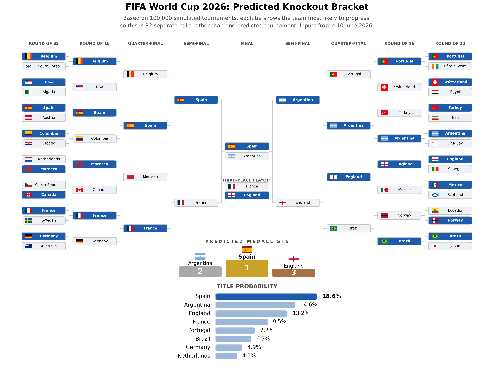
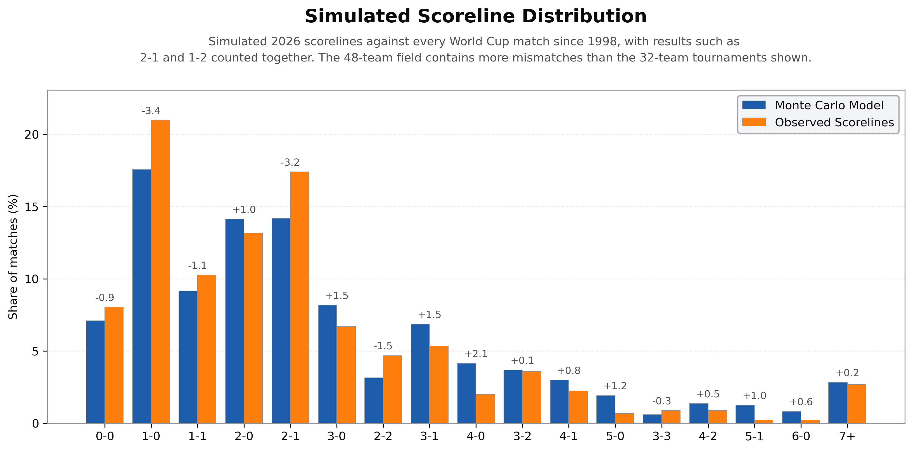

# FIFA World Cup 2026 Prediction Model



This is a Dixon-Coles Poisson engine that uses match scorelines, squad market value and World
Football Elo to forecast the 2026 World Cup, across 100,000 Monte Carlo simulations.
Team data built on international matches between June 2021 and 10 June 2026, the day before the opening match.

The methodology behind the forecast is in [01_wc_forecast](https://reeceama.github.io/FIFA-World-Cup-2026-Prediction-Model/01_wc_forecast.html).

View [02_wc_simulation](https://reeceama.github.io/FIFA-World-Cup-2026-Prediction-Model/02_wc_simulation.html) to see a single random timeline of the World Cup, determined by the model's odds, complete with potential match statistics, group tables and a knockout bracket.

Both links are rendered copies, since GitHub strips the styling from notebook tables. The
notebooks themselves are in [`notebooks/`](notebooks).

---

## Contents

1. [Forecast](#1-forecast)
2. [How it works](#2-how-it-works)
3. [Data](#3-data)
4. [Validation](#4-validation)
5. [How it performed](#5-how-it-performed)
6. [Model limitations](#6-model-limitations)
7. [Cut features](#7-cut-features)
8. [Repository layout](#8-repository-layout)
9. [Running it](#9-running-it)
10. [Future updates](#10-future-updates)
11. [References and acknowledgements](#11-references-and-acknowledgements)
12. [License](#12-license)

---

## 1. Forecast

Title probability after 100,000 simulations (seed 2026).

| Team | Model | Market |
|---|---:|---:|
| Spain | 18.6% | 16.0% |
| Argentina | 14.6% | 8.8% |
| England | 13.2% | 10.6% |
| France | 9.5% | 16.2% |
| Portugal | 7.2% | 10.2% |
| Brazil | 6.5% | 8.4% |
| Germany | 4.9% | 5.2% |
| Netherlands | 4.0% | 4.0% |

As Monte Carlo noise is roughly ±0.3pp at 100,000 simulations, teams within this range are not meaningfully separated by this run.

## 2. How it works

Each simulated match is built from an expected goal value for both sides. Those come from an
attack and a defence rating per team, created in three steps.

**Ratings from results.** A team's attack is the goals it scored divided by what an average
attack would have been expected to score against the specific defences it faced, and its
defence is the mirror of that. Both sides depend on each other, so the two are solved together
by iteration until they settle. Matches are weighted by recency, on a two-year half-life, and
by how serious the fixture was, so a qualifier counts for more than a friendly. Strength of
schedule is built into the rating.

**Blending.** Results alone are noisy, especially for teams that play few competitive games.
The solved ratings are mixed with a World Football Elo prior and with squad market values from
Transfermarkt.

**The match engine.** Expected goals for a match are `attack(home) × defence(away) × g × [home_boost(home) / home_boost(away)]`, where g lifts the level from the average the ratings are normalised on. Goals are then drawn from
independent Poisson distributions. The Dixon-Coles correction fixes the shortage of 0-0 and
1-1 scorelines that plain Poisson produces. Host nations get a boost at venues in their own
country, and a smaller boost when at venues in the other two host countries.

**The tournament.** One simulation plays all 72 group matches, builds the tables, applies
FIFA's tiebreaker order, picks the eight best third placed teams, routes everyone into the
official bracket and plays the knockouts with extra time and shootouts. Running that 100,000
times turns the ratings into probabilities.

Every parameter, what it does and how it was chosen is in [`PARAMETERS.md`](PARAMETERS.md).

## 3. Data

| source | use |
|---|---|
| [martj42/international_results](https://github.com/martj42/international_results) | international match results, 1872–2026 |
| [World Football Elo](https://www.international-football.net/elo-ratings-table) | rating prior, and pre-match Elo for every fixture |
| [Transfermarkt](https://www.transfermarkt.co.uk/vereins-statistik/wertvollstenationalmannschaften/marktwertetop) | squad market values, taken from [their post of 12 June 2026](https://www.instagram.com/p/DZd3IycFZir/) giving pre-tournament World Cup valuations |
| [Polymarket](https://polymarket.com/event/world-cup-winner) | market title odds, snapshot 10 June 2026 |
| [DataCamp](https://app.datacamp.com/learn/competitions/world-cup-prediction) | fixture list and knockout bracket template |
| [jfjelstul/worldcup](https://github.com/jfjelstul/worldcup) | card data from past World Cups (CC BY 4.0) |
| [FIFA Rankings](https://inside.fifa.com/fifa-world-ranking) | final group tiebreaker |
| [Wikipedia](https://en.wikipedia.org/wiki/Template:2026_FIFA_World_Cup_third-place_table) | which third placed groups feed which Round of 32 slots |
| [flagcdn](https://flagcdn.com) | flag images used in the charts |

Elo, Polymarket odds, flags and the third-place table are pulled by the scripts in
`data_acquisition/`. Everything else was either downloaded or compiled by hand.

Market prices are raw prices and sum to 102.2% across all 48 teams.

Squad values come from a Transfermarkt Instagram post dated 12 June 2026, two days after the
freeze date. The valuations themselves are pre-tournament.

## 4. Validation

A rolling-origin backtest was used to train up to a date, predict what follows, then move the
date forward and repeat. 17 retraining points, 2,931 held-out international matches. Every
figure in this section is reproduced by `python -m wcmodel.backtest`.

| | accuracy | log loss | RPS |
|---|---:|---:|---:|
| this model | 60.1% | 0.862 | 0.167 |
| Elo-only baseline | 59.4% | 0.892 | 0.173 |
| always back the home team | 47.6% | 1.052 | 0.228 |

RPS is the ranked probability score, which treats the three outcomes as ordered. Calling a home
win when it finished a draw costs less than calling one when it finished an away win, where log
loss charges the same for both. Lower is better.

The Elo-only baseline is similar to my model, only with the rating blend reduced to the Elo prior. 
Paired across matches, the model is 0.030 nats better (t = 5.1), meaning the model produces 
a noticable impact over just using Elo to predict the tournament.

The rating weights were picked off held-out profiles on the outer split, so that split can't
also judge the result. The backtest is independent of it.

### Calibration

A model is well calibrated when the things it calls 70% happen about 70% of the time. This table shows every 
held-out prediction, grouped by how confident it was, against how often those outcomes actually happened.

| range | model said | actually happened | matches |
|---|---:|---:|---:|
| 0-10% | 5.0% | 5.6% | 1,205 |
| 10-20% | 15.3% | 13.8% | 1,484 |
| 20-30% | 25.4% | 26.4% | 2,291 |
| 30-40% | 33.8% | 33.7% | 1,250 |
| 40-50% | 44.7% | 43.5% | 620 |
| 50-60% | 54.7% | 54.0% | 569 |
| 60-70% | 64.7% | 65.9% | 498 |
| 70-100% | 83.2% | 83.1% | 876 |

The mean absolute gap is 0.8 points, and the largest is 1.5.

## 5. How it performed

The tournament was not used to fit or select anything. These score the published forecast
against what happened, and every figure here is reproduced by `python -m wcmodel.evaluate`.

**Compared to all 104 World Cup 2026 matches.**

| | log loss | accuracy | RPS |
|---|---:|---:|---:|
| this model | 0.725 | 70/104 | 0.149 |
| Elo-only baseline | 0.788 | 68/104 | 0.170 |

Group matches are scored on 90 minute probabilities, since a group match can end level. Knockout ties are scored on who advanced, because that is what a tie resolves to once extra time and penalties are done. That is also why RPS only covers the 72 group matches, as they are the ones with three ordered outcomes.

Scored on the same matches, the model's log loss is 8.0% lower than the baseline, and a paired test gives t = 3.3.

Of the 84 matches that produced a winner, the model called 70. It called none of the 20 group matches that finished level, since a draw is never the single most likely result, and it picked the advancing side in 26 of the 32 knockout ties.

The worst call was Spain 0-0 Cabo Verde, where Spain were 93.6% to win. Every confident miss was a draw, which is the same weakness as the goal margin problem below.

The simulation averaged 2.76 goals a match against 2.96 in the tournament itself. World Cups since 1998 averaged 2.54, so the model correctly predicted that a 48-team tournament would produce more goals, but underestimated the amount.

**Group escape, 48 teams.** Brier 0.154 against 0.222 for a constant 32 of 48. The best a
perfectly calibrated forecast could have managed on these probabilities is 0.132.

**Bracket.** 26 of the 32 teams in the round of 32, 14 of 16 in the last 16, 6 of 8
quarter-finalists, all 4 semi-finalists, both finalists, and Spain as champion.

### DataCamp competition

The first version's bracket is in [`images/likely_bracket_v000.png`](images/likely_bracket_v000.png),
reconstructed from the original DataCamp competition submission that this model was based on,
so the two can be compared. That version was fully built and submitted before the tournament
kicked off. This one uses the same pre-tournament data but development began during the
tournament, so nothing it saw goes past the freeze date even though the code was written after.

That version picked the most likely scoreline for every match rather than sampling one, so its
bracket was deterministic. This was to match the requirements of the competition, which required
you to predict the exact scoreline, card numbers and corners. The scorelines are sampled here
instead, turning the output into a probability distribution.

## 6. Model limitations

**Title odds can't be validated.** One champion per tournament. The claims here are at match
level.

**Goal margins don't match history.** There are too few one goal games and draws and too many three goal
margins compared to what World Cup scorelines actually look like. Independent Poisson has no way to know a 
leading team eases off offensively, and the Dixon-Coles correction only touches the four lowest scoring results.



**One rating per team.** A team that significantly improved or regressed during the 5 year window can't 
accurately be represented by a single number.

**Cards barely matter.** Yellows and reds are simulated but don't affect a match result. They
only enter through the fair play tiebreaker, which needs teams level on points, goal difference,
goals scored and head-to-head first.

**Shootouts are a coin flip.** Treated as 50/50 to keep the model simple. Real shootouts aren't
necessarily even, but the data doesn't record which matches went to penalties, so there was nothing
to estimate an advantage from.

**Datasets don't differentiate between a played and forfeited game.** Forfeits and administrative wins enter the
ratings as scorelines, and a model built on goals has no way to discount them. The heaviest
weighted fixture in the window is one of these, Morocco's 3-0 win over Senegal in the 2025
African Cup of Nations final, which finished 1-0 the other way on the pitch. The result stands, but correcting it to that scoreline would improve Senegal's defence rating by 13.3%.

## 7. Cut features

**Shrinkage.** An exponent that compressed the rating spread, so the strongest and weakest
teams sat closer to the field. Removed to simplify the model.

**Travel fatigue.** Initially looked worth it, but most of the effect came from legs where
nobody travelled, since a large share follow a gap of a month or more. When travel was
restricted to gaps of seven days or less, its impact diminished.

**Schedule strength.** Absolute schedule tracks a team's own rating closely, so it mostly
restates who the team is. Measured relative to their own level it rewards an easy schedule as
much as it forgives a hard one. Set to zero. Opponent strength is already handled in the
rating solve.

**Current Elo modifier.** Existed in previous builds, but no version of this provided
any benefit. The decay weighted prior already covers recent form.

**A longer window.** Tested eight years of results rather than five, to include the 2018 World
Cup. Pulling in 2018 to 2021 inflates teams whose stronger period is now well behind them, such
as Brazil, Belgium and Croatia, and the decay weighting reduces that without removing it. Those
squads have largely turned over, so the extra data is describing a team that no longer exists.

Conversely, teams such as Norway are significantly stronger than they were in 2018, and
including this data punishes them for an era they've evolved past.

**Rating sampling.** Drawing a fresh rating for each team every simulation, so rating
uncertainty carried through into the odds. At the sizes tested it barely moved the forecast,
and without standard errors on the ratings the size becomes arbitrary.

**Age normalised squad values.** Market value is inflated for younger players relative to their current ability, so squad value was regressed on average squad age first to stop a team being rated up for having an expensive young squad. It added unnecessary complexity for little
to no gain.

## 8. Repository layout

```
├── src/wcmodel/                      the model, installed as a package
│   ├── team_data.py                  loading, weighting, rating solve, blend
│   ├── match.py                      Dixon-Coles match engine
│   ├── tournament.py                 group tables, tiebreakers, bracket, aggregation
│   ├── charts.py                     every figure
│   ├── fit_mle.py                    two-stage calibration and profile likelihoods
│   ├── backtest.py                   rolling-origin backtest, baselines and calibration
│   └── evaluate.py                   scores the published forecast against what happened
│
├── data_acquisition/                 run only to refresh the committed data
│   ├── fetch_elo.py
│   ├── fetch_polymarket.py
│   ├── fetch_flags.py
│   └── third_place_table.py
│
├── docs/                             rendered notebooks, served by GitHub Pages
│
├── notebooks/
│   ├── 01_wc_forecast.ipynb          methodology and results
│   └── 02_wc_simulation.ipynb        one sampled tournament, start to finish
│
├── data/
│   ├── results.csv                   international results, 1872-2026
│   ├── group_fixtures.csv            the 72 group matches, with venues
│   ├── knockout_slots.csv            bracket template and routing
│   ├── third_place_table.json        best-third groups to Round of 32 slots
│   ├── wf_elo_history.csv            per-fixture Elo, used for the rating prior
│   ├── wf_current_elo.csv            Elo snapshot, 10 June 2026 (display only)
│   ├── wf_avg_elo.csv                team eligibility
│   ├── tm_squad_values.csv           Transfermarkt squad values
│   ├── wc_2026_polymarket_odds.csv   market snapshot, 10 June 2026
│   ├── wc_bookings.csv               card data from past World Cups
│   ├── fifa_rankings_wc2026.csv      final group tiebreaker
│   ├── flag_codes.csv                team name to ISO code, for flag rendering
│   ├── flags/                        48 team flag PNGs
│   ├── calibration/                  fitted parameters and profile curves
│   ├── 100k_monte_carlo/             the published forecast
│   └── 100k_v000_reconstruction/     first draft's ratings, reconstructed
│
├── images/                           generated figures
│
├── run_forecast.py                   runs the simulation, writes a run folder
├── pyproject.toml
├── PARAMETERS.md
├── CHANGELOG.md
├── README.md
├── LICENSE
└── .gitignore
```

Each run folder holds `progression_table.csv`, `group_escape.csv`, `likely_bracket.csv`,
`scoreline_distribution.csv`, `team_stats.csv` and `forecast_run.json`, the last recording the
seed, parameters and freeze date behind that run.

## 9. Running it

```bash
pip install -e .

# produce a forecast using the parameters in the repo
python run_forecast.py 100000

# refit the parameters and write the profile curves, for inspection
python -m wcmodel.fit_mle

# rolling-origin backtest against the Elo-only baseline
python -m wcmodel.backtest

# score the published forecast against the tournament
python -m wcmodel.evaluate
```

`fit_mle` reports parameters rather than setting them. The values the model runs on live in
`match.py` and `team_data.py`, so refitting does not change a forecast on its own.

## 10. Future updates

**v1.x.x, SQL.** Move the simulation outputs into a SQL database and write the queries the
dashboard needs.

**v1.x.x, Tableau.** Build a dashboard on that database. It would show title odds, progression
by round, group qualification and the head-to-head matchups, filtered by confederation and
group.

**v1.x.x, support for multiple tournaments.** Hosts, venues, group count and the freeze date
are hardcoded at the moment. Pulling them out into a config file per tournament would let the
same engine run the Euros or the Copa America.

**v2.x.x, a new simulation engine.** The goal margin problem in the limitations needs a model that
knows the score, so goals would be simulated through the 90 minutes at a rate that changes as
the game goes on. A Bayesian version of the ratings would also give real uncertainty on each
one, which is what the rating sampling idea was missing. Kick-by-kick shootouts and changed
game states based on card data and goal momentum could be added too.

## 11. References and acknowledgements

Dixon, M. J., & Coles, S. G. (1997). Modelling association football scores and inefficiencies
in the football betting market. *Journal of the Royal Statistical Society: Series C (Applied
Statistics)*, *46*(2), 265–280. https://doi.org/10.1111/1467-9876.00065

The project started as an entry to a DataCamp prediction competition, which is where the
fixture list and bracket template come from.

## 12. License

Code released under the [MIT License](LICENSE).

The data files are redistributed from their original sources so the project is reproducible,
and remain subject to those sources' own terms.
